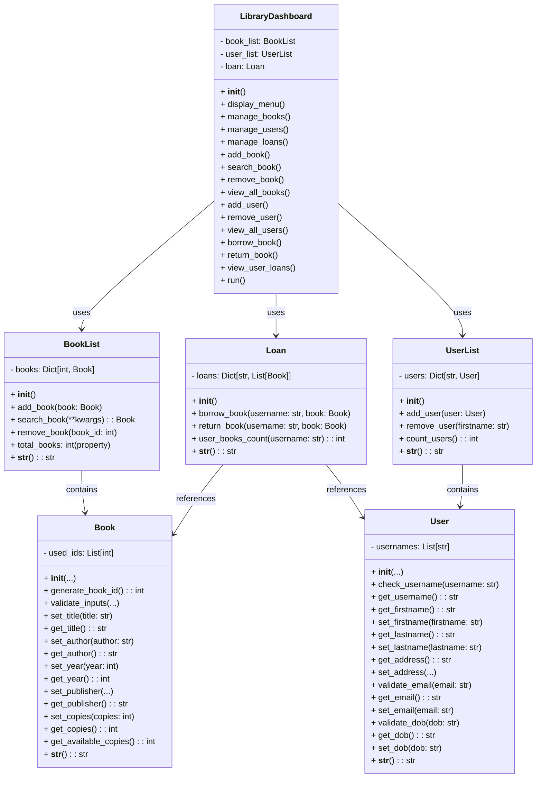

# UML Class Diagram: Library Management System

## Classes

### Book
| **Attribute/Method**       | **Type**                  | **Description**                           |
|----------------------------|--------------------------|-------------------------------------------|
| `used_ids`                 | List[int]                | Class attribute to store used book IDs    |
| `__init__`                 | Constructor              | Initialize a book instance                |
| `generate_book_id()`       | int                      | Generate a unique book ID                 |
| `validate_inputs(...)`     | None                     | Validate inputs for the book              |
| `set_title(title: str)`    | None                     | Set the book title                        |
| `get_title()`              | str                      | Get the book title                        |
| `set_author(author: str)`  | None                     | Set the book author                       |
| `get_author()`             | str                      | Get the book author                       |
| `set_year(year: int)`      | None                     | Set the year of publication               |
| `get_year()`               | int                      | Get the year of publication               |
| `set_publisher(...)`       | None                     | Set the publisher                         |
| `get_publisher()`          | str                      | Get the publisher                         |
| `set_copies(copies: int)`  | None                     | Set the number of copies                  |
| `get_copies()`             | int                      | Get the total number of copies            |
| `get_available_copies()`   | int                      | Get the number of available copies        |
| `__str__()`                | str                      | Return a string representation of the book|

### BookList
| **Attribute/Method**       | **Type**                  | **Description**                           |
|----------------------------|--------------------------|-------------------------------------------|
| `books`                    | Dict[int, Book]          | Store book instances                      |
| `__init__`                 | Constructor              | Initialize the book list                  |
| `add_book(book: Book)`     | None                     | Add a book to the list                    |
| `search_book(**kwargs)`    | Book                     | Search for a book using key-value pairs   |
| `remove_book(book_id: int)`| None                     | Remove a book by its ID                   |
| `total_books`              | int (property)           | Get the total number of books             |
| `__str__()`                | str                      | Return a string representation of the list|

### User
| **Attribute/Method**       | **Type**                  | **Description**                           |
|----------------------------|--------------------------|-------------------------------------------|
| `usernames`                | List[str]                | Class attribute to store usernames        |
| `__init__`                 | Constructor              | Initialize a user instance                |
| `check_username(username)` | None                     | Validate uniqueness of username           |
| `get_username()`           | str                      | Get the username                          |
| `get_firstname()`          | str                      | Get the first name                        |
| `set_firstname(firstname)` | None                     | Set the first name                        |
| `get_lastname()`           | str                      | Get the last name                         |
| `set_lastname(lastname)`   | None                     | Set the last name                         |
| `get_address()`            | str                      | Get the user's address                    |
| `set_address(...)`         | None                     | Set the user's address                    |
| `validate_email(email)`    | None                     | Validate the user's email                 |
| `get_email()`              | str                      | Get the user's email                      |
| `set_email(email)`         | None                     | Set the user's email                      |
| `validate_dob(dob)`        | None                     | Validate the user's date of birth         |
| `get_dob()`                | str                      | Get the user's date of birth              |
| `set_dob(dob)`             | None                     | Set the user's date of birth              |
| `__str__()`                | str                      | Return a string representation of the user|

### UserList
| **Attribute/Method**       | **Type**                  | **Description**                           |
|----------------------------|--------------------------|-------------------------------------------|
| `users`                    | Dict[str, User]          | Store user instances                      |
| `__init__`                 | Constructor              | Initialize the user list                  |
| `add_user(user: User)`     | None                     | Add a user to the list                    |
| `remove_user(firstname)`   | None                     | Remove a user by their first name         |
| `count_users()`            | int                      | Get the total number of users             |
| `__str__()`                | str                      | Return a string representation of the list|

### Loan
| **Attribute/Method**       | **Type**                  | **Description**                           |
|----------------------------|--------------------------|-------------------------------------------|
| `loans`                    | Dict[str, List[Book]]    | Store loans as user-book mappings         |
| `__init__`                 | Constructor              | Initialize the loan system                |
| `borrow_book(username, book)` | None                  | Borrow a book for a user                  |
| `return_book(username, book)` | None                  | Return a borrowed book                    |
| `user_books_count(username)` | int                    | Count books borrowed by a user            |
| `__str__()`                | str                      | Return a string representation of the loans|

### LibraryDashboard
| **Attribute/Method**       | **Type**                  | **Description**                           |
|----------------------------|--------------------------|-------------------------------------------|
| `book_list`                | BookList                 | Book list instance                        |
| `user_list`                | UserList                 | User list instance                        |
| `loan`                     | Loan                     | Loan system instance                      |
| `__init__()`               | Constructor              | Initialize the library dashboard          |
| `display_menu()`           | None                     | Display the main menu                     |
| `manage_books()`           | None                     | Manage books                              |
| `manage_users()`           | None                     | Manage users                              |
| `manage_loans()`           | None                     | Manage loans                              |
| `add_book()`               | None                     | Add a new book                            |
| `search_book()`            | None                     | Search for a book                         |
| `remove_book()`            | None                     | Remove a book                             |
| `view_all_books()`         | None                     | View all books                            |
| `add_user()`               | None                     | Add a new user                            |
| `remove_user()`            | None                     | Remove a user                             |
| `view_all_users()`         | None                     | View all users                            |
| `borrow_book()`            | None                     | Borrow a book                             |
| `return_book()`            | None                     | Return a book                             |
| `view_user_loans()`        | None                     | View user loans                           |
| `run()`                    | None                     | Run the library dashboard                 |

## Relationships

| **Class**        | **Related Class** | **Relationship Type**     |
|------------------|-------------------|---------------------------|
| `LibraryDashboard` | `BookList`       | Uses                       |
| `LibraryDashboard` | `UserList`       | Uses                       |
| `LibraryDashboard` | `Loan`           | Uses                       |
| `BookList`         | `Book`           | Contains                   |
| `Loan`             | `Book`           | References                 |
| `Loan`             | `User`           | References                 |
| `UserList`         | `User`           | Contains                   |

