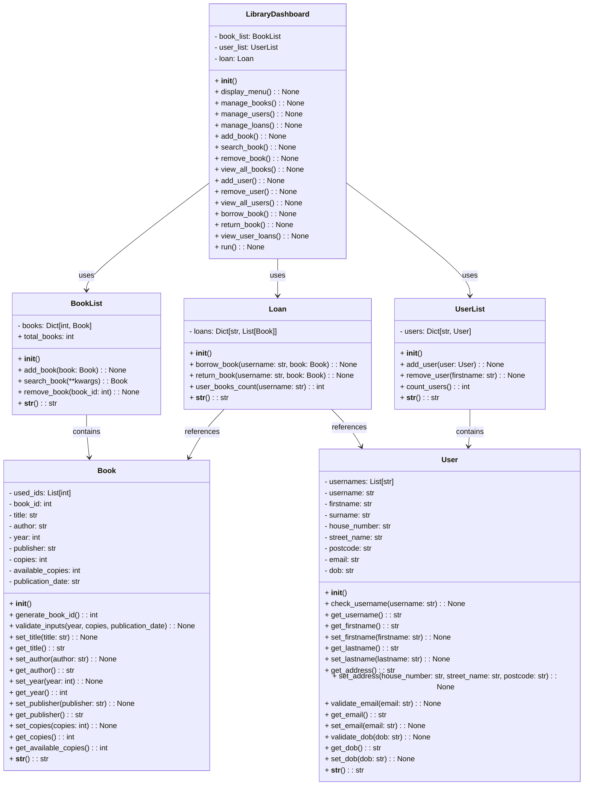

# UML Class Diagram: Library Management System

<!-- TOC -->

- [UML Class Diagram: Library Management System](#uml-class-diagram-library-management-system)
    - [A Mermaid Class Diagram](#a-mermaid-class-diagram)
    - [Classes](#classes)
        - [Book](#book)
        - [BookList](#booklist)
        - [User](#user)
        - [UserList](#userlist)
        - [Loan](#loan)
        - [LibraryDashboard](#librarydashboard)

<!-- /TOC -->

## A Mermaid Class Diagram

## Classes

### Book
| **Attributes**             | **Type**                  | **Description**                           |
|----------------------------|--------------------------|-------------------------------------------|
| `used_ids`                 | List[int]                | List of used book IDs                     |
| `book_id`                  | int                      | Unique ID for the book                    |
| `title`                    | str                      | Title of the book                         |
| `author`                   | str                      | Author of the book                        |
| `year`                     | int                      | Year of publication                       |
| `publisher`                | str                      | Publisher of the book                     |
| `copies`                   | int                      | Total number of copies                    |
| `available_copies`         | int                      | Number of available copies                |
| `publication_date`         | str                      | Publication date in YYYY-MM-DD format     |

| **Methods**                | **Return Type**           | **Description**                           |
|----------------------------|--------------------------|-------------------------------------------|
| `__init__`                 | Constructor              | Initialize a book instance                |
| `generate_book_id()`       | int                      | Generate a unique book ID                 |
| `validate_inputs(...)`     | None                     | Validate the inputs for year, copies, and publication date |
| `set_title(title: str)`    | None                     | Set the book title                        |
| `get_title()`              | str                      | Get the book title                        |
| `set_author(author: str)`  | None                     | Set the book author                       |
| `get_author()`             | str                      | Get the book author                       |
| `set_year(year: int)`      | None                     | Set the year of publication               |
| `get_year()`               | int                      | Get the year of publication               |
| `set_publisher(...)`       | None                     | Set the publisher                         |
| `get_publisher()`          | str                      | Get the publisher                         |
| `set_copies(copies: int)`  | None                     | Set the number of copies                  |
| `get_copies()`             | int                      | Get the total number of copies            |
| `get_available_copies()`   | int                      | Get the number of available copies        |
| `__str__()`                | str                      | Return a string representation of the book|

### BookList
| **Attributes**             | **Type**                  | **Description**                           |
|----------------------------|--------------------------|-------------------------------------------|
| `books`                    | Dict[int, Book]          | Dictionary to store book instances        |

| **Methods**                | **Return Type**           | **Description**                           |
|----------------------------|--------------------------|-------------------------------------------|
| `__init__()`               | Constructor              | Initialize the book list                  |
| `add_book(book: Book)`     | None                     | Add a book to the collection              |
| `search_book(**kwargs)`    | Book                     | Search for a book using key-value pairs   |
| `remove_book(book_id: int)`| None                     | Remove a book by its ID                   |
| `total_books`              | int (property)           | Get the total number of books             |
| `__str__()`                | str                      | Return a string representation of the list|

### User
| **Attributes**             | **Type**                  | **Description**                           |
|----------------------------|--------------------------|-------------------------------------------|
| `usernames`                | List[str]                | List of registered usernames              |
| `username`                 | str                      | Unique username of the user               |
| `firstname`                | str                      | First name of the user                    |
| `surname`                  | str                      | Last name of the user                     |
| `house_number`             | str                      | House number of the user                  |
| `street_name`              | str                      | Street name of the user                   |
| `postcode`                 | str                      | Postcode of the user                      |
| `email`                    | str                      | Email address of the user                 |
| `dob`                      | str                      | Date of birth in YYYY-MM-DD format        |

| **Methods**                | **Return Type**           | **Description**                           |
|----------------------------|--------------------------|-------------------------------------------|
| `__init__()`               | Constructor              | Initialize a user instance                |
| `check_username(username)` | None                     | Validate the uniqueness of the username   |
| `get_username()`           | str                      | Get the username                          |
| `get_firstname()`          | str                      | Get the first name                        |
| `set_firstname(firstname)` | None                     | Set the first name                        |
| `get_lastname()`           | str                      | Get the last name                         |
| `set_lastname(lastname)`   | None                     | Set the last name                         |
| `get_address()`            | str                      | Get the user's address                    |
| `set_address(...)`         | None                     | Set the user's address                    |
| `validate_email(email)`    | None                     | Validate the user's email address         |
| `get_email()`              | str                      | Get the user's email address              |
| `set_email(email)`         | None                     | Set the user's email address              |
| `validate_dob(dob)`        | None                     | Validate the user's date of birth         |
| `get_dob()`                | str                      | Get the user's date of birth              |
| `set_dob(dob)`             | None                     | Set the user's date of birth              |
| `__str__()`                | str                      | Return a string representation of the user|

### UserList
| **Attributes**             | **Type**                  | **Description**                           |
|----------------------------|--------------------------|-------------------------------------------|
| `users`                    | Dict[str, User]          | Dictionary to store user instances        |

| **Methods**                | **Return Type**           | **Description**                           |
|----------------------------|--------------------------|-------------------------------------------|
| `__init__()`               | Constructor              | Initialize the user list                  |
| `add_user(user: User)`     | None                     | Add a user to the collection              |
| `remove_user(firstname)`   | None                     | Remove a user by their first name         |
| `count_users()`            | int                      | Get the total number of users             |
| `__str__()`                | str                      | Return a string representation of the list|

### Loan
| **Attributes**             | **Type**                  | **Description**                           |
|----------------------------|--------------------------|-------------------------------------------|
| `loans`                    | Dict[str, List[Book]]    | Dictionary to store loans by users        |

| **Methods**                | **Return Type**           | **Description**                           |
|----------------------------|--------------------------|-------------------------------------------|
| `__init__()`               | Constructor              | Initialize the loan system                |
| `borrow_book(...)`         | None                     | Borrow a book for a user                  |
| `return_book(...)`         | None                     | Return a borrowed book                    |
| `user_books_count(username)` | int                    | Count the books borrowed by a user        |
| `__str__()`                | str                      | Return a string representation of the loans|

### LibraryDashboard
| **Attributes**             | **Type**                  | **Description**                           |
|----------------------------|--------------------------|-------------------------------------------|
| `book_list`                | BookList                 | Instance of BookList                      |
| `user_list`                | UserList                 | Instance of UserList                      |
| `loan`                     | Loan                     | Instance of Loan                          |

| **Methods**                | **Return Type**           | **Description**                           |
|----------------------------|--------------------------|-------------------------------------------|
| `__init__()`               | Constructor              | Initialize the library dashboard          |
| `display_menu()`           | None                     | Display the main menu                     |
| `manage_books()`           | None                     | Menu for managing books                   |
| `manage_users()`           | None                     | Menu for managing users                   |
| `manage_loans()`           | None                     | Menu for managing loans                   |
| `add_book()`               | None                     | Add a new book to the library             |
| `search_book()`            | None                     | Search for a book in the library          |
| `remove_book()`            | None                     | Remove a book from the library            |
| `view_all_books()`         | None                     | View all books in the library             |
| `add_user()`               | None                     | Add a new user to the library             |
| `remove_user()`            | None                     | Remove a user from the library            |
| `view_all_users()`         | None                     | View all users in the library             |
| `borrow_book()`            | None                     | Borrow a book for a user                  |
| `return_book()`            | None                     | Return a borrowed book                    |
| `view_user_loans()`        | None                     | View books borrowed by a user             |
| `run()`                    | None                     | Run the library dashboard                 |

